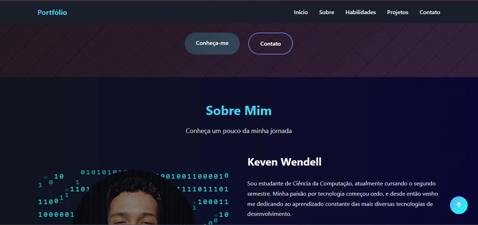

# 🌐 Meu Portfólio

Este é o meu portfólio pessoal, criado para apresentar meus projetos, habilidades e formas de contato.

## 🚀 Tecnologias usadas
- HTML5
- CSS3
- JavaScript
- [ Em breve usarei React.js e adicionarei mais efeitos visuais e usar php em breve também...]

## 📂 Estrutura do projeto
- `index.html` → página principal
- `arq-css/` → estilos
- `js/` → scripts
- `imgs/` → imagens, ícones

## 💻 Como visualizar
1. Clone este repositório:
   ```bash
   git clone https://github.com/Keven-W/Keven-portf-lio.git

## 📸 Demonstração   

